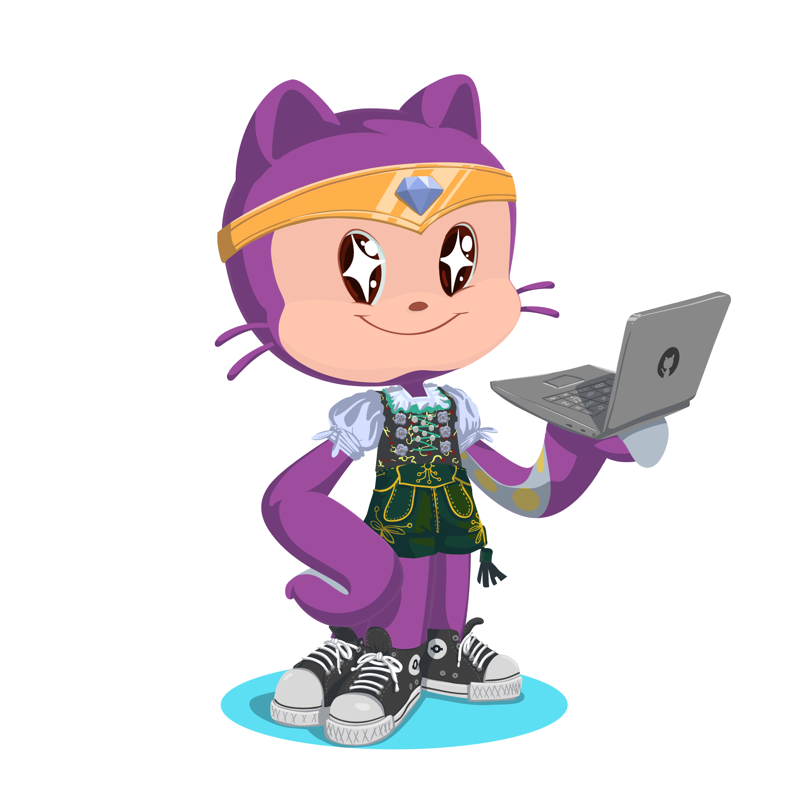

  <h1>
    
  </h1>

  

#  Learning Journey

### Currently exploring:
- **Natural Language Processing (NLP)**  
- **Retrieval-Augmented Generation (RAG) systems**  
- **LangChain framework**  
- Implementing **research papers from scratch**

---

##  Socials

  

  

  

---
#  Tech Stack

   
   
   
   
   
   
   
   
   
   
   

---

### 🖥️ My Weekly Coding Stats

---

  

---
